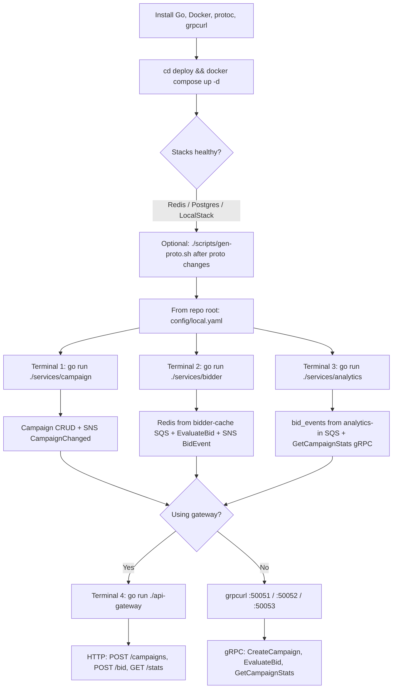
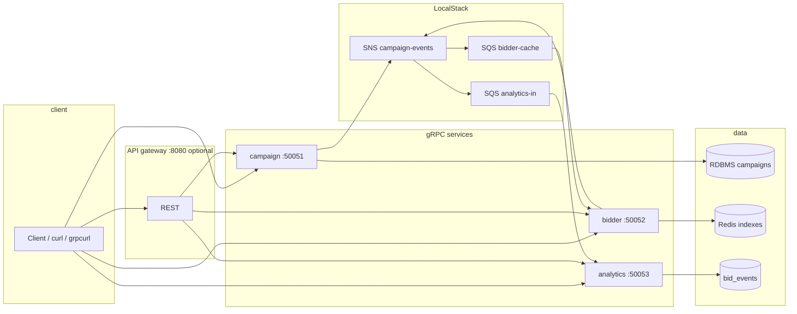
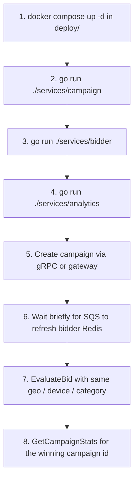

# ad-bidding-platform

## Project structure

```
.
├── README.md
├── api-gateway
│   ├── client
│   ├── handler
│   └── router
├── config
├── deploy
│   └── localstack-init
├── go.mod
├── internal
│   ├── analytics
│   │   ├── domain
│   │   ├── events
│   │   ├── handler
│   │   ├── repository
│   │   └── service
│   ├── bidder
│   │   ├── cache
│   │   ├── domain
│   │   ├── events
│   │   ├── handler
│   │   └── service
│   ├── campaign
│   │   ├── domain
│   │   ├── events
│   │   ├── handler
│   │   ├── repository
│   │   └── service
│   └── platform
│       ├── awsx
│       ├── config
│       ├── db
│       ├── logx
│       └── redisx
├── scripts
└── services
    ├── analytics
    ├── bidder
    └── campaign
```

## Generate protobuf

From the repository root:

```bash
chmod +x scripts/gen-proto.sh
./scripts/gen-proto.sh
```

This runs `protoc` on `proto/campaign`, `proto/bidder`, and `proto/analytics`. You need [`protoc`](https://grpc.io/docs/protoc-installation/) plus `protoc-gen-go` and `protoc-gen-go-grpc` on your `PATH` (for example `go install google.golang.org/protobuf/cmd/protoc-gen-go@latest` and `go install google.golang.org/grpc/cmd/protoc-gen-go-grpc@latest`).

## Local stack

From `deploy/`:

```bash
cd deploy
docker compose up -d
```

### Verify setup

From `deploy/` (same shell as `docker compose up`). If you changed `docker-compose.yml`, recreate containers so healthchecks apply: `docker compose up -d --force-recreate`.

- `docker compose ps` shows all four services as `(healthy)` once checks have passed (give MySQL a short first-boot window on a fresh volume).
- `docker compose exec redis redis-cli ping` prints `PONG` (uses the Redis container; no host `redis-cli` needed).
- `docker compose exec localstack awslocal sns list-topics` includes `campaign-events` (no host `awslocal` needed).

If you prefer host CLIs instead, install Redis client tools and [awscli-local](https://github.com/localstack/awscli-local), then use `redis-cli -h 127.0.0.1 ping` and `awslocal sns list-topics` against the published ports.

### Troubleshooting: no bids / empty Redis after creating a campaign

Campaign changes reach the bidder through **SNS → SQS → bidder consumer**. If **SNS has no subscriptions** to `bidder-cache` / `analytics-in`, messages never arrive and Redis stays empty (`SMEMBERS idx:status:active` is empty).

Check subscriptions (inside LocalStack):

```bash
docker exec deploy-localstack-1 awslocal sns list-subscriptions-by-topic \
  --topic-arn arn:aws:sns:us-east-1:000000000000:campaign-events
```

If the list is empty, wire subscriptions from the repo root:

```bash
./scripts/wire-localstack-subscriptions.sh
```

Then **create or update a campaign again** so a new `CampaignChanged` event flows through. Alternatively recreate LocalStack so `deploy/localstack-init/bootstrap.sh` runs on a fresh volume (`docker compose down -v && docker compose up -d`).

## How to use this service

The diagrams below render on GitHub and in editors that support [Mermaid](https://mermaid.js.org/).

### End-to-end usage (local dev)



### Request and event paths



### Happy path checklist


