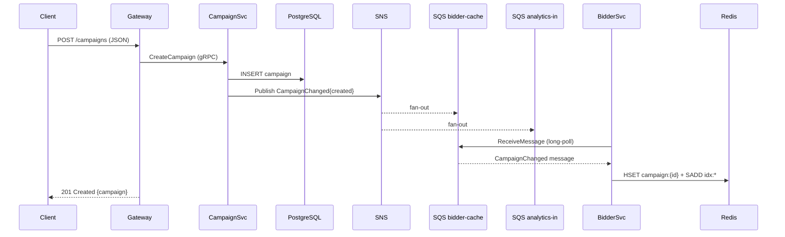
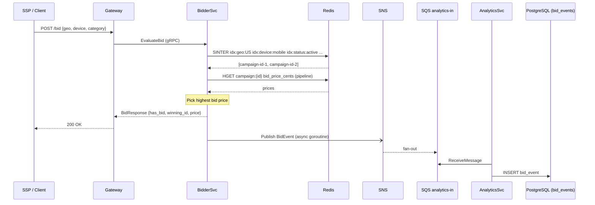
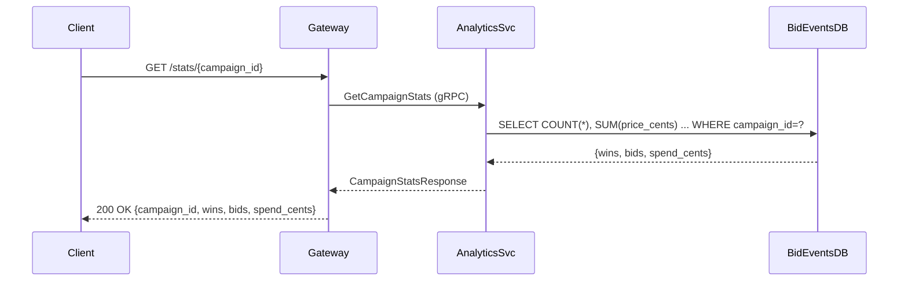
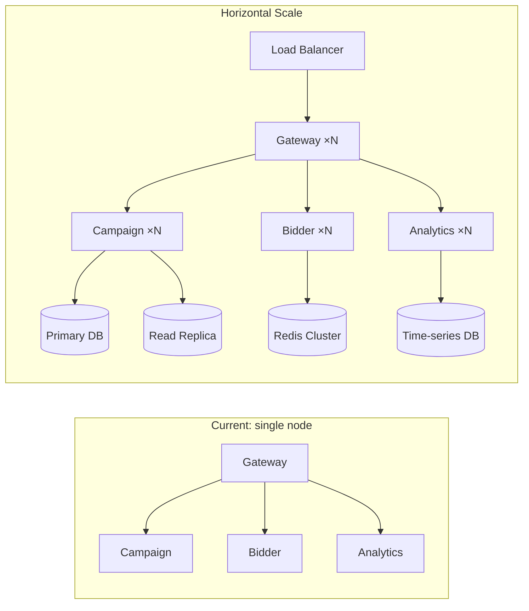

# High-Level Design (HLD) — Ad Bidding Platform

## 1. Overview

The Ad Bidding Platform is a **real-time programmatic advertising system** that lets advertisers define campaigns with targeting rules, evaluates live bid requests against those campaigns in sub-millisecond time, and records outcomes for analytics reporting.

The system is built as a set of independently deployable microservices communicating over **gRPC** internally and exposed to external callers through an **HTTP/REST API Gateway**.

---

## 2. Functional Requirements

| # | Requirement |
|---|---|
| FR-1 | Advertisers can **create, read, update, and delete** campaigns with targeting attributes (geo, device, category) and bid prices. |
| FR-2 | The platform can **evaluate a bid request** in real time given targeting attributes and return the winning campaign and price. |
| FR-3 | Every bid outcome must be **recorded** and made available for per-campaign analytics (impressions, wins, spend). |
| FR-4 | Campaign changes must **propagate automatically** to the bidder's hot cache without a service restart. |
| FR-5 | The system must expose a single **REST + Swagger** entry point so clients do not need a gRPC library. |
| FR-6 | Services must emit **structured logs** and remain observable in production. |

---

## 3. Non-Functional Requirements

| # | Requirement | Target |
|---|---|---|
| NFR-1 | **Latency** — Bid evaluation must be fast. | P99 < 10 ms |
| NFR-2 | **Throughput** — Support concurrent bid evaluations. | ≥ 1 000 RPS per node |
| NFR-3 | **Availability** — Services are stateless and horizontally scalable. | 99.9% uptime |
| NFR-4 | **Eventual consistency** — Campaign updates reach the bidder within seconds via the event pipeline. | < 5 s propagation |
| NFR-5 | **Fault isolation** — A failure in analytics must not affect bid evaluation. | Independent crash domains |
| NFR-6 | **Observability** — Every service emits JSON-structured logs with request tracing via interceptors. | Structured slog output |
| NFR-7 | **Portability** — Full local dev environment with Docker Compose; no cloud account needed. | LocalStack emulation |
| NFR-8 | **Extensibility** — New targeting dimensions can be added without changing the bidder service. | Proto contract versioning |

---

## 4. System Architecture

```
┌─────────────────────────────────────────────────────────────────┐
│                         Clients / SSPs                          │
└──────────────────────────────┬──────────────────────────────────┘
                               │ HTTP/REST
                               ▼
┌──────────────────────────────────────────────────────────────────┐
│                   API Gateway  :8080                             │
│          (Go net/http + Swagger UI at /swagger/)                 │
└────────────┬──────────────────┬──────────────────┬──────────────┘
             │ gRPC             │ gRPC             │ gRPC
             ▼                 ▼                  ▼
┌────────────────┐   ┌─────────────────┐  ┌─────────────────────┐
│ Campaign Svc   │   │  Bidder Svc     │  │  Analytics Svc      │
│ :50051         │   │  :50052         │  │  :50053             │
│                │   │                 │  │                      │
│ CRUD + events  │   │ EvaluateBid     │  │ GetCampaignStats     │
└───────┬────────┘   └──────┬──────────┘  └──────────┬──────────┘
        │                   │                         │
        │ writes            │ reads                   │ writes
        ▼                   ▼                         ▼
┌───────────────┐   ┌───────────────┐       ┌────────────────────┐
│  PostgreSQL   │   │    Redis      │       │  PostgreSQL /      │
│  (campaigns) │   │  (hot cache)  │       │  MySQL (bid_events)│
└───────┬───────┘   └───────────────┘       └────────────────────┘
        │
        │ publishes CampaignChanged
        ▼
┌───────────────────────────────────────┐
│             AWS SNS                   │
│         campaign-events topic         │
└─────────────┬──────────────┬──────────┘
              │ fan-out      │ fan-out
              ▼              ▼
┌─────────────────┐  ┌──────────────────┐
│  SQS            │  │  SQS             │
│  bidder-cache   │  │  analytics-in    │
└────────┬────────┘  └────────┬─────────┘
         │                    │
         │ consumed by        │ consumed by
         ▼                    ▼
    Bidder Svc          Analytics Svc
    (updates Redis)     (records bid_events)
```

---

## 5. Component Responsibilities

### 5.1 API Gateway

- Converts HTTP/JSON requests into gRPC calls to downstream services.
- Serves the Swagger UI at `/swagger/`.
- Acts as the single entry point — external callers never need to know gRPC addresses.
- Adds request/response logging via middleware.

### 5.2 Campaign Service

- Owns the **source of truth** for campaigns (stored in a relational DB).
- Validates and persists campaign CRUD operations.
- Publishes a `CampaignChanged` event to SNS whenever a campaign is created, updated, or deleted.

### 5.3 Bidder Service

- Answers bid requests at **ultra-low latency** by reading only from Redis (no DB calls in the hot path).
- Maintains a Redis hot cache kept fresh by consuming the `bidder-cache` SQS queue.
- After every winning bid, publishes a `BidEvent` to SNS so analytics can record the outcome.

### 5.4 Analytics Service

- Consumes the `analytics-in` SQS queue for bid event records.
- Persists raw bid events to a relational DB.
- Exposes `GetCampaignStats` gRPC RPC that returns aggregated wins, bids, and spend.

### 5.5 SNS / SQS (Event Bus)

- **SNS** decouples producers (Campaign Service) from consumers (Bidder, Analytics).
- **SQS** provides durable, at-least-once delivery with long-polling for efficient consumption.
- Fan-out means new consumers can be added without modifying the Campaign Service.

---

## 6. Data Flow Diagrams

### 6.1 Campaign Creation & Cache Propagation



### 6.2 Bid Evaluation (Hot Path)



### 6.3 Analytics Query



---

## 7. Technology Choices & Benefits

| Technology | Role | Why chosen |
|---|---|---|
| **Go** | All services | Compiled, fast startup, excellent concurrency via goroutines, strong gRPC/protobuf ecosystem |
| **gRPC + Protobuf** | Inter-service communication | Typed contracts, binary efficiency, bidirectional streaming capability, auto-generated clients |
| **Redis** | Bidder hot cache | Sub-millisecond set-intersection (`SINTER`) for multi-dimensional targeting lookups; atomic pipeline for writes |
| **PostgreSQL / MySQL** | Persistent storage | ACID guarantees for campaign records and bid events; GORM supports both with a single driver switch |
| **AWS SNS + SQS** | Async event bus | Durable fan-out (SNS → multiple SQS queues), at-least-once delivery, long-polling for low-latency consumption; decouples services completely |
| **LocalStack** | Local AWS emulation | Zero-cost, zero-cloud-account local development; full SNS/SQS API compatibility |
| **Docker Compose** | Local dev orchestration | Reproducible environment; one command boots Redis, Postgres, MySQL, LocalStack |
| **net/http ServeMux** (Go 1.22+) | API Gateway routing | Built-in path parameters (`{id}`), no external dependency, minimal overhead |
| **swaggo/swag** | Swagger / OpenAPI | Generates docs from code comments — no separate YAML files to maintain |
| **slog** | Structured logging | Standard library (Go 1.21+), JSON + console output, zero extra deps |

---

## 8. Deployment Topology (Local)

```
┌──────────────────────── Docker Compose Network ───────────────────────────┐
│                                                                            │
│   ┌──────────────┐   ┌────────────────┐   ┌──────────────┐               │
│   │  Redis :6379 │   │ Postgres :5432 │   │ MySQL :3306  │               │
│   └──────────────┘   └────────────────┘   └──────────────┘               │
│   ┌─────────────────────────────────────────────────────────┐             │
│   │  LocalStack :4566  (SNS + SQS)                          │             │
│   └─────────────────────────────────────────────────────────┘             │
└────────────────────────────────────────────────────────────────────────────┘
         ▲            ▲              ▲            ▲
         │            │              │            │
┌────────────────────────────────────────────────────┐
│              Host Machine (Go services)            │
│                                                    │
│  go run ./services/campaign   → :50051             │
│  go run ./services/bidder     → :50052             │
│  go run ./services/analytics  → :50053             │
│  go run ./services/gateway    → :8080              │
└────────────────────────────────────────────────────┘
```

---

## 9. Security Considerations (Future Work)

| Area | Recommendation |
|---|---|
| Transport | Add mTLS on gRPC channels in production |
| Authentication | Attach JWT/API-key validation middleware in the API Gateway |
| Secret management | Move credentials out of `config/local.yaml` into Vault or AWS Secrets Manager |
| Rate limiting | Add per-IP token-bucket middleware at the gateway layer |
| Input validation | Centralise protobuf field validators (e.g. `protovalidate`) |

---

## 10. Scalability Path



Each service is **stateless at the process level** (state lives in Redis / DB / SQS), so adding more instances requires only a load balancer change.
