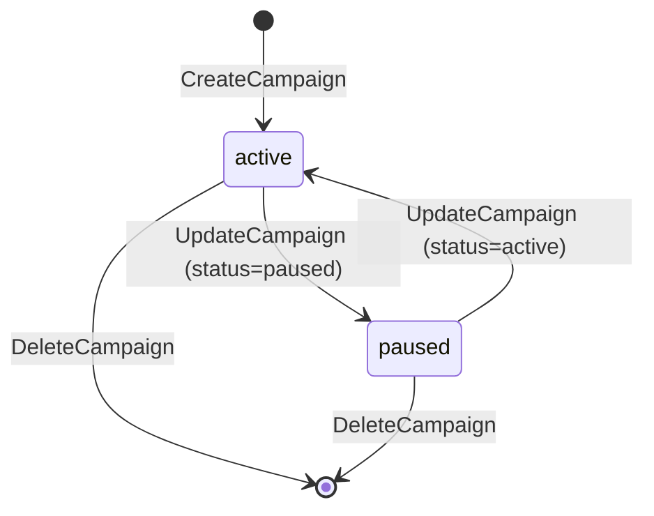
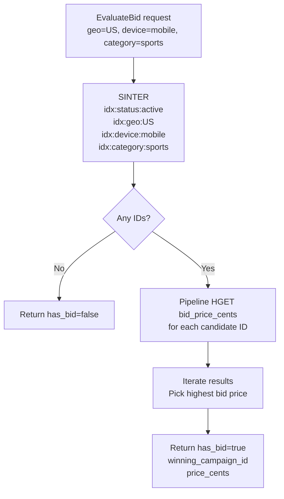
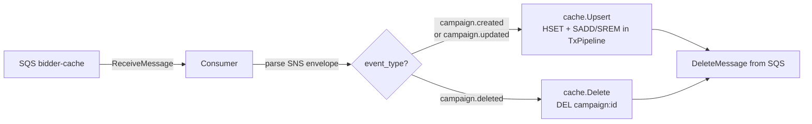
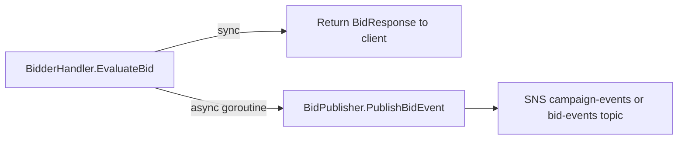
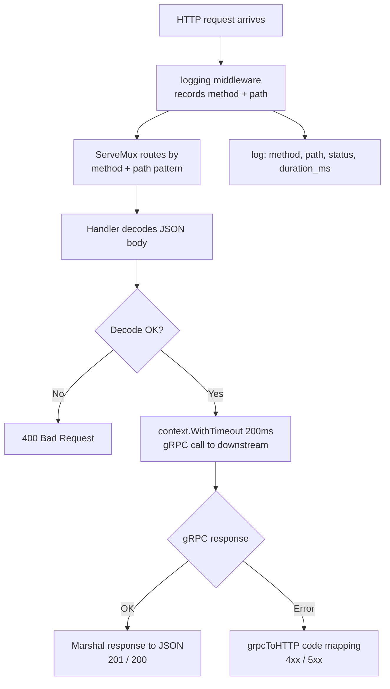
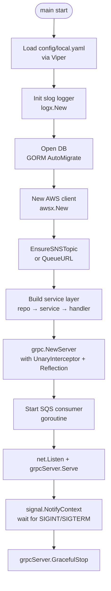

# Low-Level Design (LLD) — Ad Bidding Platform

## 1. Module Map

```
ad-bidding-platform/
├── api-gateway/
│   ├── client/          # gRPC client pool (clients.go)
│   ├── docs/            # swaggo-generated OpenAPI spec
│   ├── handler/         # HTTP handlers + Swagger annotations
│   └── router/          # ServeMux wiring + logging middleware
├── internal/
│   ├── analytics/
│   │   ├── domain/      # BidEvent, Stats value objects
│   │   ├── events/      # SQS consumer
│   │   ├── handler/     # gRPC handler
│   │   ├── repository/  # GORM bid_event repo
│   │   └── service/     # business logic
│   ├── bidder/
│   │   ├── cache/       # Redis inverted-index cache
│   │   ├── domain/      # (targeting types)
│   │   ├── events/      # SQS consumer + SNS publisher
│   │   ├── handler/     # gRPC handler
│   │   └── service/     # highest-bid selection
│   ├── campaign/
│   │   ├── domain/      # Campaign aggregate, Status enum
│   │   ├── events/      # SNS publisher
│   │   ├── handler/     # gRPC handler
│   │   ├── repository/  # GORM campaign repo
│   │   └── service/     # CRUD + validation
│   └── platform/
│       ├── awsx/        # AWS client factory (SNS/SQS helpers)
│       ├── config/      # Viper config structs
│       ├── db/          # GORM dial helper
│       ├── interceptors/# shared gRPC unary logging interceptor
│       ├── logx/        # slog factory
│       └── redisx/      # Redis client factory
├── proto/
│   ├── campaign/        # campaign.proto + generated Go stubs
│   ├── bidder/          # bidder.proto + generated Go stubs
│   └── analytics/       # analytics.proto + generated Go stubs
└── services/
    ├── campaign/main.go
    ├── bidder/main.go
    ├── analytics/main.go
    └── gateway/main.go
```

---

## 2. Domain Models

### 2.1 Campaign (`internal/campaign/domain`)

```
Campaign
├── ID            string       (UUID v4)
├── AdvertiserID  string
├── Name          string
├── BudgetCents   int64        (stored in cents to avoid floats)
├── BidPriceCents int64
├── Geo           string       (e.g. "US", "IN")
├── Device        string       (e.g. "mobile", "desktop")
├── Category      string       (e.g. "sports", "tech")
├── Status        Status       ("active" | "paused")
├── CreatedAt     time.Time
└── UpdatedAt     time.Time
```

Status is a typed string constant (not an enum) to keep DB values human-readable.

### 2.2 BidEvent (`internal/analytics/domain`)

```
BidEvent
├── ID         string     (UUID v4)
├── CampaignID string
├── Won        bool
├── PriceCents int64
├── Geo        string
├── Device     string
├── Category   string
└── Timestamp  time.Time
```

### 2.3 Stats (`internal/analytics/domain`)

```
Stats
├── CampaignID string
├── Wins       int64   (rows WHERE won = true)
├── Bids       int64   (total rows)
└── SpendCents int64   (SUM price_cents WHERE won = true)
```

---

## 3. gRPC Service Contracts

### 3.1 CampaignService (`proto/campaign/campaign.proto`)

```protobuf
service CampaignService {
  rpc CreateCampaign(CreateCampaignRequest) returns (CampaignResponse);
  rpc GetCampaign   (GetCampaignRequest)    returns (CampaignResponse);
  rpc ListCampaigns (ListCampaignsRequest)  returns (ListCampaignsResponse);
  rpc UpdateCampaign(UpdateCampaignRequest) returns (CampaignResponse);
  rpc DeleteCampaign(DeleteCampaignRequest) returns (DeleteCampaignResponse);
}
```

**Validation rules** (enforced in `CampaignService`):
- `Name` must be non-empty.
- `BudgetCents` and `BidPriceCents` must be > 0.
- `ID` must be non-empty for get / update / delete.

### 3.2 BidderService (`proto/bidder/bidder.proto`)

```protobuf
service BidderService {
  rpc EvaluateBid(BidRequest) returns (BidResponse);
}

message BidRequest  { string request_id; string geo; string device; string category; }
message BidResponse { bool has_bid; string winning_campaign_id; int64 price_cents; }
```

### 3.3 AnalyticsService (`proto/analytics/analytics.proto`)

```protobuf
service AnalyticsService {
  rpc GetCampaignStats(CampaignStatsRequest) returns (CampaignStatsResponse);
}

message CampaignStatsRequest  { string campaign_id; }
message CampaignStatsResponse { string campaign_id; int64 wins; int64 bids; int64 spend_cents; }
```

---

## 4. Campaign Service — Internals

### 4.1 Layer diagram

```
gRPC request
     │
     ▼
┌─────────────────────────────┐
│  handler.CampaignHandler    │  → embeds UnimplementedCampaignServiceServer
│  (grpc.go)                  │  → delegates to CampaignService
└──────────────┬──────────────┘
               │
               ▼
┌─────────────────────────────┐
│  service.CampaignService    │  → validation, UUID generation, status defaults
│  (campaign_service.go)      │
└──────┬───────────┬──────────┘
       │           │
       ▼           ▼
┌──────────┐  ┌────────────────────────┐
│  repo    │  │  events.Publisher      │
│  (GORM)  │  │  (SNS publish)         │
└──────────┘  └────────────────────────┘
```

### 4.2 Event message schema (CampaignChanged)

```json
{
  "event_type": "campaign.created",   // | "campaign.updated" | "campaign.deleted"
  "campaign_id": "uuid",
  "advertiser_id": "adv-001",
  "name": "Summer Sale",
  "budget_cents": 100000,
  "bid_price_cents": 500,
  "geo": "US",
  "device": "mobile",
  "category": "sports",
  "status": "active",
  "occurred_at": "2026-05-07T15:04:05Z"
}
```

### 4.3 Campaign state machine



---

## 5. Bidder Service — Internals

### 5.1 Redis data structures

The bidder uses **inverted indexes** built from Redis Sets for O(1) set-intersection targeting.

| Redis key | Type | Content |
|---|---|---|
| `campaign:{id}` | Hash | `bid_price_cents`, `geo`, `device`, `category`, `status` |
| `idx:status:active` | Set | Campaign IDs currently active |
| `idx:geo:{geo}` | Set | Campaign IDs targeting this geo |
| `idx:device:{device}` | Set | Campaign IDs targeting this device |
| `idx:category:{cat}` | Set | Campaign IDs targeting this category |

### 5.2 FindCandidates algorithm



**Complexity:** `O(min-set-size)` for `SINTER` + `O(candidates)` for the pipeline. Typically sub-millisecond at moderate scale.

### 5.3 Cache consistency (Upsert path)



TxPipeline ensures the hash write and index updates are atomic from Redis's perspective.

### 5.4 Bid event publishing (async)

After `EvaluateBid` returns the winner to the caller, the handler fires a goroutine with a short context timeout (e.g. 500 ms) that publishes the `BidEvent` to SNS. The caller receives the response immediately — analytics recording is best-effort and non-blocking.



---

## 6. Analytics Service — Internals

### 6.1 Layer diagram

```
SQS analytics-in
     │
     ▼
┌──────────────────────────────────┐
│  events.Consumer.Run (loop)      │  long-poll, 10 msgs, 10 s wait
│  → handle()                      │  unwrap SNS envelope
│  → filter campaign.* events      │  skip CampaignChanged messages
└───────────────┬──────────────────┘
                │ BidEvent
                ▼
┌──────────────────────────────────┐
│  service.AnalyticsService        │
│  → RecordBid(ctx, *BidEvent)     │
└───────────────┬──────────────────┘
                │
                ▼
┌──────────────────────────────────┐
│  repository.GormBidEventRepo     │
│  → Insert(ctx, *BidEvent)        │  INSERT INTO bid_events
│  → GetStats(ctx, campaignID)     │  SELECT COUNT/SUM with GROUP BY
└──────────────────────────────────┘
```

### 6.2 `bid_events` table schema

```sql
CREATE TABLE bid_events (
    id          TEXT PRIMARY KEY,
    campaign_id TEXT        NOT NULL,
    won         BOOLEAN     NOT NULL DEFAULT false,
    price_cents BIGINT      NOT NULL DEFAULT 0,
    geo         TEXT,
    device      TEXT,
    category    TEXT,
    timestamp   TIMESTAMPTZ NOT NULL
);

CREATE INDEX idx_bid_events_campaign_id ON bid_events (campaign_id);
```

### 6.3 GetStats SQL

```sql
SELECT
    campaign_id,
    COUNT(*)                             AS bids,
    COUNT(*) FILTER (WHERE won = true)   AS wins,
    SUM(price_cents) FILTER (WHERE won = true) AS spend_cents
FROM bid_events
WHERE campaign_id = ?
GROUP BY campaign_id;
```

---

## 7. API Gateway — Internals

### 7.1 Route table

| Method | Path | Handler | gRPC target |
|---|---|---|---|
| GET | `/healthz` | `Health` | — |
| POST | `/campaigns` | `CreateCampaign` | `CampaignService.CreateCampaign` |
| GET | `/campaigns` | `ListCampaigns` | `CampaignService.ListCampaigns` |
| GET | `/campaigns/{id}` | `GetCampaign` | `CampaignService.GetCampaign` |
| PUT | `/campaigns/{id}` | `UpdateCampaign` | `CampaignService.UpdateCampaign` |
| DELETE | `/campaigns/{id}` | `DeleteCampaign` | `CampaignService.DeleteCampaign` |
| POST | `/bid` | `EvaluateBid` | `BidderService.EvaluateBid` |
| GET | `/stats/{id}` | `GetCampaignStats` | `AnalyticsService.GetCampaignStats` |
| GET | `/swagger/` | Swagger UI | — |

### 7.2 gRPC → HTTP error mapping

| gRPC code | HTTP status |
|---|---|
| `NotFound` | 404 |
| `InvalidArgument` | 400 |
| `AlreadyExists` | 409 |
| `Unauthenticated` | 401 |
| `PermissionDenied` | 403 |
| everything else | 500 |

### 7.3 Request lifecycle



---

## 8. Platform Layer

### 8.1 Config (`internal/platform/config`)

Single `Config` struct unmarshalled from YAML via Viper with env-var override support.

```
Config
├── Server
│   ├── CampaignGRPCPort / BidderGRPCPort / AnalyticsGRPCPort / GatewayHTTPPort
│   └── CampaignGRPCAddr / BidderGRPCAddr / AnalyticsGRPCAddr
├── Database  (driver, dsn, pool settings)
├── Redis     (addr, db, pool_size, password)
├── AWS       (endpoint, region, account_id, sns_topic, queues, credentials)
└── Log       (level, format)
```

Environment variable override follows `SECTION_KEY` naming (e.g. `DATABASE_DSN`).

### 8.2 AWS helpers (`internal/platform/awsx`)

| Function | Purpose |
|---|---|
| `New(cfg)` | Creates `aws.Config` with static credentials for LocalStack or default chain for prod |
| `SNSTopicARN(cfg)` | Builds `arn:aws:sns:{region}:{accountID}:{topicName}` |
| `EnsureSNSTopic(ctx, sns, cfg)` | Idempotent `CreateTopic`; returns existing ARN if already present |
| `QueueURL(ctx, sqs, cfg, name)` | Idempotent `CreateQueue` + `GetQueueUrl`; works on LocalStack resets |

### 8.3 gRPC Interceptor (`internal/platform/interceptors`)

`UnarySlogInterceptor` is a server-side unary interceptor that logs every RPC call:

```
INFO  rpc  service=campaign method=/campaign.CampaignService/CreateCampaign duration_ms=3
```

Applied uniformly across all three gRPC services via `grpc.ChainUnaryInterceptor`.

### 8.4 logx (`internal/platform/logx`)

Factory that returns a `*slog.Logger` configured for either `console` (human-readable) or `json` (machine-readable) output at the configured level. The default logger (`slog.SetDefault`) is replaced at startup so all packages using `slog.Info(...)` automatically pick it up.

---

## 9. Service Startup Sequence



gRPC server reflection is enabled on every service so tools like `grpcurl` can discover methods without the `.proto` files.

---

## 10. Key Design Decisions

| Decision | Chosen approach | Alternatives considered | Reason |
|---|---|---|---|
| Inter-service communication | gRPC + Protobuf | REST/JSON, GraphQL | Type safety, binary efficiency, strong contracts, generated clients |
| Bidder hot path data store | Redis inverted index | DB query per request, in-memory map | Sub-millisecond SINTER; Redis survives bidder restarts |
| Event bus | SNS fan-out → SQS queues | Kafka, RabbitMQ, direct DB polling | Simpler ops than Kafka; native AWS; emulatable with LocalStack |
| Bid winner selection | Highest bid price | Second-price auction, floor price | Simplest correct algorithm; swap-out ready via service layer |
| Analytics recording | Async post-bid goroutine | Synchronous before response | Keeps bid latency unaffected by DB write speed |
| HTTP framework | stdlib `net/http` (Go 1.22) | Chi, Gin, Echo | Zero dependency; path parameters built-in since Go 1.22 |
| Swagger generation | Source annotations (`swaggo/swag`) | Hand-written OpenAPI YAML | Docs live next to code, always in sync |
| Local AWS | LocalStack | Moto, ElasticMQ | Full SNS+SQS in one container; Docker Compose friendly |
